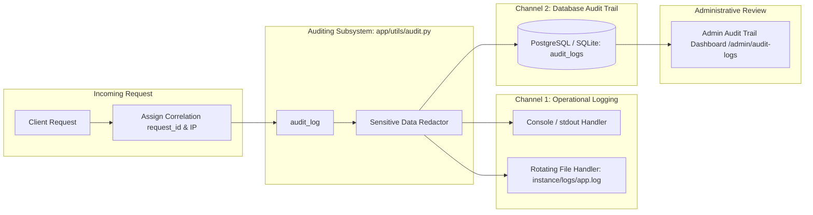

# Logging and Auditing

The application implements a centralized, dual-channel logging and security
auditing subsystem adhering to the OWASP Logging Cheat Sheet:
https://cheatsheetseries.owasp.org/cheatsheets/Logging_Cheat_Sheet.html

It separates high-frequency operational telemetry from tamper-evident, queryable
security audit records, ensuring complete traceability without leaking credentials
or degrading application performance.

---

## 1. Dual-Channel Architecture



### Channel 1: Structured Operational Logging
- **Log Format:**
  `%(asctime)s %(levelname)s [%(request_id)s] ip=%(client_ip)s %(method)s %(path)s user=%(user)s %(message)s`
- **Correlation ID (`request_id`):** Every request generates or accepts a 64-char
  `X-Request-ID` header attached to Flask `g.request_id` and reflected on HTTP responses.
- **Dual Stream:** Emits simultaneously to `sys.stdout` (for Docker, container
  aggregators, and cloud log shippers) and a rotating file (`instance/logs/app.log`,
  max 5 MiB, 5 backups).
- **Request Lifecycle Timing:** Logs HTTP status code and request execution duration
  in milliseconds on request completion.

### Channel 2: Database Audit Trail (`AuditLog`)
- Persisted in the `audit_logs` database table.
- Queryable via the administrator dashboard at `/admin/audit-logs`.
- Supports both authenticated actions (linked via `user_id`) and unauthenticated
  security events (e.g., failed logins for invalid accounts, rate-limiting violations).
- **Fail-Safe Persistence:** Database audit writes catch errors and rollback safely;
  an auditing or database glitch never causes an unexpected HTTP 500 error for users.

---

## 2. Event Taxonomy

| Event Name | Severity | Description |
| :--- | :---: | :--- |
| `AUTH_LOGIN_SUCCESS` | INFO | User successfully authenticated via password. |
| `AUTH_LOGIN_FAILURE` | WARNING | Authentication failed due to incorrect password or missing user. |
| `AUTH_LOGIN_BLOCKED` | WARNING | Login attempted against a deactivated or banned account. |
| `AUTH_LOGOUT` | INFO | User explicitly signed out and session revoked. |
| `AUTH_SESSION_CREATED` | INFO | New authenticated server session initialized. |
| `AUTH_SESSION_EXPIRED` | WARNING | Session revoked due to idle timeout (30m) or absolute timeout (12h). |
| `AUTH_2FA_SENT` | INFO | One-time verification code generated and dispatched via email. |
| `AUTH_2FA_SUCCESS` | INFO | Two-factor verification code verified successfully. |
| `AUTH_2FA_FAILURE` | WARNING | Invalid or expired two-factor verification code provided. |
| `AUTH_PASSWORD_RESET_SUCCESS`| INFO | Password updated successfully via verified reset code. |
| `AUTH_PASSKEY_LOGIN` | INFO | Successful WebAuthn passkey biometric authentication. |
| `AUTH_OAUTH_LOGIN` | INFO | Successful Google OAuth login. |
| `SECURITY_RATE_LIMIT_EXCEEDED`| WARNING | Client exceeded global, auth, or expensive endpoint rate limits. |
| `SECURITY_VALIDATION_ERROR`| WARNING | Malformed payload, invalid types, or illegal redirect attempt. |
| `SECURITY_OVERSIZED_PAYLOAD`| WARNING | Request payload exceeded `MAX_CONTENT_LENGTH`. |
| `USERS_EXPORT` | INFO | Administrative export of user directory. |
| `USER_BAN` / `USER_UNBAN` | INFO | Administrative modification of user active status. |
| `KNOWLEDGE_BASE_UPDATE`| INFO | Expert modifications to crops, diseases, or diagnostic rules. |

---

## 3. Data Protection & Credential Redaction

Under no circumstances are secrets, tokens, or raw credentials written to
disk, standard output, or database audit tables.

The redaction engine in [app/utils/audit.py](file:///Users/ahzarjy/Documents/Ai/Project_Assignment/app/utils/audit.py)
automatically sanitizes:
- Passwords (`password`, `passwd`, `pwd`)
- Verification codes and OTPs (`code`, `otp`)
- Authentication tokens and API secrets (`secret`, `token`, `id_token`)
- Authorization headers (`Bearer`, `Basic`)
- Session cookies

Example:
```text
Raw:    email=farmer@test.com password=SuperSecretPassword123 code=928174
Logged: email=farmer@test.com password=[REDACTED] code=[REDACTED]
```

---

## 4. Verification & Testing

Run the test suite from the repository root:

```sh
.venv/bin/python -m unittest discover -s tests -v
```

The dedicated test suite in [tests/test_logging_and_auditing.py](file:///Users/ahzarjy/Documents/Ai/Project_Assignment/tests/test_logging_and_auditing.py) validates:
1. Structured log formatting and `request_id` correlation enrichment.
2. Dual-channel dispatch (logger + database `AuditLog`).
3. Automated redaction of sensitive credentials.
4. Unauthenticated and authenticated audit trail records.
5. Rate limit breach audit event triggers.
6. Fail-safe isolation (verifying that database errors during auditing do not crash requests).
