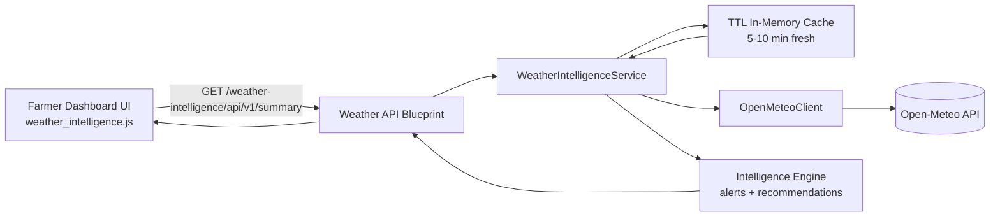

# Ultra Advanced Weather Intelligence Module

## 1. System Architecture

This module is implemented as an isolated weather microservice boundary inside the Flask app:

- UI isolation: Farmer dashboard only consumes a small JSON endpoint.
- Logic isolation: Weather logic lives under `app/services/weather_intelligence/`.
- API isolation: Dedicated blueprint under `app/blueprints/weather_intelligence/`.
- Provider isolation: External API calls are abstracted by `OpenMeteoClient`.
- Resilience: 10-minute TTL cache + stale fallback + offline browser cache.

### Architecture Diagram

## 2. API Recommendation

Recommended provider: **Open-Meteo**

Why:

1. No API key required for non-commercial use (faster integration, less credential risk).
2. Includes required hourly and daily fields for rain/temperature/humidity/wind analytics.
3. Includes weather codes needed for storm/heavy-rain/heat intelligence.
4. Commercial-scale upgrade path is available when moving to paid SLAs.

References:

- https://open-meteo.com/en/docs
- https://open-meteo.com/en/features
- https://open-meteo.com/en/pricing

## 3. Backend Structure

### New module files

- `app/services/weather_intelligence/client.py`
- `app/services/weather_intelligence/cache.py`
- `app/services/weather_intelligence/intelligence.py`
- `app/services/weather_intelligence/service.py`
- `app/blueprints/weather_intelligence/routes.py`

### API Endpoint

- `GET /weather-intelligence/api/v1/summary?lat=<float>&lon=<float>`
- Auth: farmer role required.
- Output: normalized weather summary with:
  - `current`
  - `forecast` (7 days)
  - `analytics`
  - `alerts`
  - `recommendations`
  - `meta` (`live`, `cache`, `stale-cache`, `fallback`)

## 4. Frontend Integration

### Dashboard integration

- Added Weather Intelligence card in:
  - `app/templates/farmer/dashboard.html`
- Styles:
  - `app/static/css/weather_intelligence.css`
- Client module:
  - `app/static/js/weather_intelligence.js`

### UX behavior

1. Lazy loads with `IntersectionObserver` to avoid blocking first paint.
2. Requests user geolocation (with timeout).
3. Calls lightweight weather endpoint.
4. Renders color-coded alerts:
   - red: danger
   - orange: warning
   - green: safe
   - blue: info
5. Uses localStorage fallback when internet/API fails.

## 5. Caching and Fallback Strategy

### Server-side

- Fresh cache TTL: `WEATHER_CACHE_TTL_SECONDS` (default 600s).
- Stale fallback TTL: `WEATHER_STALE_TTL_SECONDS` (default 21600s).
- Request timeout: `WEATHER_REQUEST_TIMEOUT_SECONDS` (default 6s).

### Client-side

- Stores last successful payload in localStorage.
- Shows cached data immediately, then refreshes in background.
- If request fails, keeps UI functional using cached snapshot.

## 6. Security and Performance Best Practices

1. Keep external weather key/API config in environment only.
2. Apply short timeouts and never block route handlers.
3. Avoid direct browser calls to external weather provider.
4. Restrict API endpoint to authenticated farmer role.
5. Round coordinate cache key to improve hit ratio and reduce provider calls.
6. Send cache headers for browser-level optimization.

## 7. Scalability Path (Future AI)

This module is ready for extension without touching core diagnosis logic:

1. Add `PredictionEngine` for 14-day/seasonal risk scoring.
2. Attach crop profiles from crop DB to make crop-specific advisories.
3. Add message queue or scheduler for proactive weather push alerts.
4. Move weather module into its own deployable container unchanged (API contract stable).
