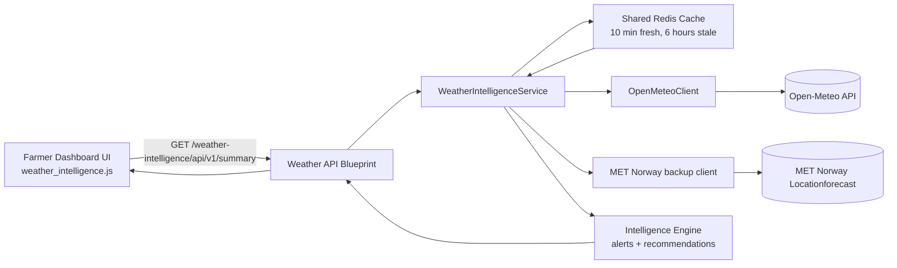

# Ultra Advanced Weather Intelligence Module

## Railway weather repair — 2026-09-19

- Deployed `6af9e0bb-a3f2-4721-a256-57fd1c2fb929` successfully to `backend`.
- Verified HTTPS health at the Railway domain (204), updated dashboard script,
  Redis connectivity, and cooldown reuse by independent app instances in both
  English and Khmer without a second upstream call.
- At 05:01 UTC, Open-Meteo still rejected the Railway request with HTTP 429.
  The app now reports `provider_rate_limited` with a 900-second retry cooldown.
  Live weather restoration remains dependent on the provider allowing requests.
- Validation: 12 backend weather tests and 6 browser-script tests passed;
  existing session and database bootstrap regression checks also passed.
- Deployment preserved the existing production session defaults. The unrelated
  local 15-day session edits were left intact and excluded from this deployment.

### Backup provider follow-up

Deployed `a641b799-8f49-4e72-ad15-3072ac31c92a` successfully on 2026-09-19.
At 05:21 UTC the running Railway app returned a MET Norway forecast for Phnom
Penh: 31.7 C, 66.4% humidity, 2.5 km/h wind, light rain, and seven forecast days,
with `meta.degraded=false`. An independent app instance reused the Redis forecast
in Khmer without calling either upstream provider. Health and the deployed
dashboard script passed; 22 Python weather tests and 7 browser-script tests pass.

MET Norway Locationforecast is now the backup when Open-Meteo is unavailable.
Its public API returned HTTP 200 from Railway during the connectivity check.
The adapter identifies the application, rounds coordinates to three decimals,
honors `Expires`, uses `If-Modified-Since`, and independently cools down after
backup-provider failures. No subscription or API key is required.

Backup forecasts use Cambodia time (`Asia/Phnom_Penh`), convert wind from m/s to
km/h, and derive seven-day estimates from the available forecast periods. Rain
in six-hour periods is apportioned across local dates; temperature ranges use
model samples or supplied period extrema. Today's totals cover remaining hours.
The dashboard labels MET Norway forecasts, includes CC BY 4.0 attribution, and
notes that daily values are estimates. After HTTP 304, the current forecast is
recomputed from the original time series rather than reusing old current values.

References: https://api.met.no/doc/TermsOfService and
https://docs.api.met.no/doc/locationforecast/datamodel.html

## 1. System Architecture

This module is implemented as an isolated weather microservice boundary inside the Flask app:

- UI isolation: Farmer dashboard only consumes a small JSON endpoint.
- Logic isolation: Weather logic lives under `app/services/weather_intelligence/`.
- API isolation: Dedicated blueprint under `app/blueprints/weather_intelligence/`.
- Provider isolation: External API calls are abstracted by `OpenMeteoClient`.
- Resilience: 10-minute TTL cache + stale fallback + offline browser cache.

### Architecture Diagram


```mermaid
flowchart LR
    A[Farmer Dashboard UI<br/>weather_intelligence.js] -->|GET /weather-intelligence/api/v1/summary| B[Weather API Blueprint]
    B --> C[WeatherIntelligenceService]
    C --> D[Shared Redis Cache<br/>10 min fresh, 6 hours stale]
    C --> E[OpenMeteoClient]
    E --> F[(Open-Meteo API)]
    C --> H[MET Norway backup client]
    H --> I[(MET Norway Locationforecast)]
    C --> G[Intelligence Engine<br/>alerts + recommendations]
    G --> B
    D --> C
    B --> A
```

## 2. API Recommendation

Recommended provider: **Open-Meteo**

Why:

1. No API key required for non-commercial use (faster integration, less credential risk).
2. Includes required hourly and daily fields for rain/temperature/humidity/wind analytics.
3. Includes weather codes needed for storm/heavy-rain/heat intelligence.
4. Commercial-scale upgrade path is available when moving to paid SLAs.

References:

- https://open-meteo.com/en/docs
- https://open-meteo.com/en/features
- https://open-meteo.com/en/pricing

## 3. Backend Structure

### New module files

- `app/services/weather_intelligence/client.py`
- `app/services/weather_intelligence/cache.py`
- `app/services/weather_intelligence/intelligence.py`
- `app/services/weather_intelligence/service.py`
- `app/blueprints/weather_intelligence/routes.py`

### API Endpoint

- `GET /weather-intelligence/api/v1/summary?lat=<float>&lon=<float>`
- Auth: farmer role required.
- Output: normalized weather summary with:
  - `current`
  - `forecast` (7 days)
  - `analytics`
  - `alerts`
  - `recommendations`
  - `meta` (`live`, `cache`, `stale-cache`, `fallback`)

## 4. Frontend Integration

### Dashboard integration

- Added Weather Intelligence card in:
  - `app/templates/farmer/dashboard.html`
- Styles:
  - `app/static/css/weather_intelligence.css`
- Client module:
  - `app/static/js/weather_intelligence.js`

### UX behavior

1. Lazy loads with `IntersectionObserver` to avoid blocking first paint.
2. Requests user geolocation (with timeout).
3. Calls lightweight weather endpoint.
4. Renders color-coded alerts:
   - red: danger
   - orange: warning
   - green: safe
   - blue: info
5. Uses localStorage fallback when internet/API fails.

## 5. Caching and Fallback Strategy

### Server-side

- Fresh cache TTL: `WEATHER_CACHE_TTL_SECONDS` (default 600s).
- Stale fallback TTL: `WEATHER_STALE_TTL_SECONDS` (default 21600s).
- Request timeout: `WEATHER_REQUEST_TIMEOUT_SECONDS` (default 6s).
- Production automatically reuses `SESSION_REDIS_URL` when `SESSION_TYPE=redis`;
  `WEATHER_REDIS_URL` can override it. Weather uses its own `agri:weather:v2:`
  namespace and does not modify sessions. Without Redis, use the local cache.
- Raw forecasts are shared across workers, restarts, and English/Khmer requests.
- Upstream HTTP 429 sets a shared provider cooldown: `Retry-After` when supplied
  (60s–24h), otherwise 15 minutes. Other provider failures pause requests for 60s.
- Degraded responses include `meta.error_code` and `meta.retry_after_seconds` and
  are not HTTP-cached. Empty analytics are `null`, never invented zero readings.

### Client-side

- Stores last successful payload in localStorage.
- Shows cached data immediately, then refreshes in background.
- If request fails, keeps UI functional using cached snapshot.
- Provider failures do not overwrite successful browser snapshots. Fallbacks must
  match the requested location and be at most six hours old. Saved weather shows
  its original timestamp. The dashboard explains rate limits and retries after
  the cooldown automatically.

Run regression checks with:

```sh
.venv/bin/python -m unittest discover -s tests -p 'test_weather*.py' -v
node --test tests/test_weather_intelligence.cjs
```

Caching cannot remove an already exhausted upstream quota. While Open-Meteo is
limited, the app uses MET Norway forecasts. If both providers fail, it serves
valid stale data or clearly reports unavailable values. No paid subscription is
configured.

## 6. Security and Performance Best Practices

1. Keep external weather key/API config in environment only.
2. Apply short timeouts and never block route handlers.
3. Avoid direct browser calls to external weather provider.
4. Restrict API endpoint to authenticated farmer role.
5. Round coordinate cache key to improve hit ratio and reduce provider calls.
6. Send cache headers for browser-level optimization.

## 7. Scalability Path (Future AI)

This module is ready for extension without touching core diagnosis logic:

1. Add `PredictionEngine` for 14-day/seasonal risk scoring.
2. Attach crop profiles from crop DB to make crop-specific advisories.
3. Add message queue or scheduler for proactive weather push alerts.
4. Move weather module into its own deployable container unchanged (API contract stable).
